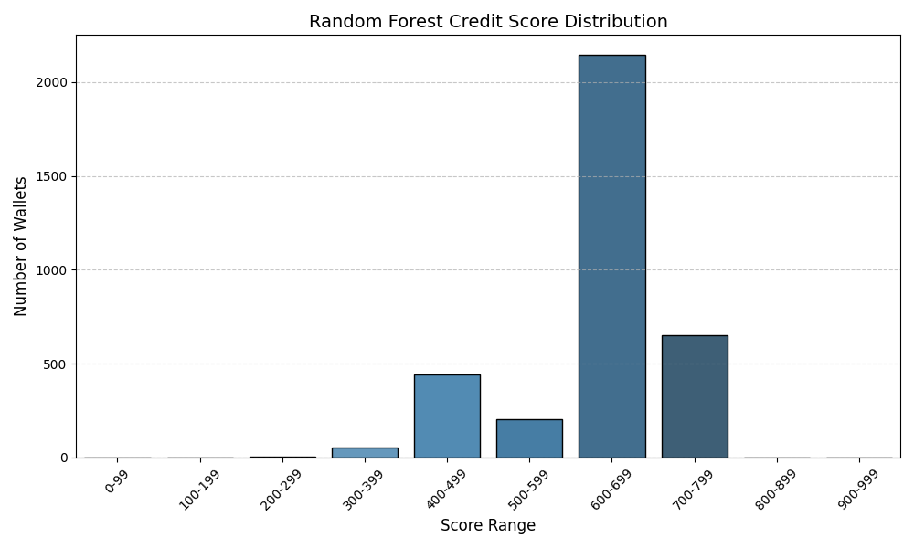

# 🔐 DeFi Wallet Credit Scoring (Aave V2)

This project develops a machine learning-based credit scoring system for DeFi wallets based on transaction-level data from the Aave V2 protocol. It processes raw JSON logs to assign each wallet a score between 0 and 1000 — where higher scores indicate more reliable and responsible DeFi behavior.

📊 Goal: Help DeFi platforms identify trustworthy wallets and detect risky or bot-like actors.

---

## 📁 Project Structure

- user-wallet-transactions.json – Raw transaction data (~100K records)
- CreditScoring.ipynb – Main notebook with data parsing, feature engineering, and model training
- wallet_scores.json – Rule-based score output (0–1000)
- wallet_scores_rf.json – ML-enhanced (Random Forest) score output
- analysis_plot_rf.png – Visual distribution of scores
- analysis_plot_rf.py – Script to generate score distribution plot
- analysis.md – Behavioral insights based on score ranges
- README.md – This file

---

## 📦 Features Extracted per Wallet

From the raw JSON logs, the following features were engineered:

- Total number of transactions
- Number of unique action types (deposit, borrow, repay, redeem, liquidation)
- Sum of deposit, borrow, repay, and redeem amounts
- Liquidation event count
- Repay/Borrow ratio
- Borrow/Deposit ratio
- Bot-likeness: high volume but low action diversity
- Active time span (days between first and last transaction)

---

## 🧠 Scoring Logic

🛠️ Two scoring approaches were used:

1. Rule-Based Score (pseudo_score)

A transparent heuristic that rewards:
- Strong repay behavior (repay ≥ borrow)
- Diverse actions (≥ 4 unique types)
- No liquidations
- Balanced borrowing

And penalizes:
- Liquidation events
- Borrowing more than depositing
- Bot-like patterns

2. ML-Based Score (rf_score)

- Trained a RandomForestRegressor using the engineered features and the pseudo_score as a weak label
- Final scores were clipped to 0–1000 and saved to wallet_scores_rf.json
- Feature importance analysis included

---

## 📈 Visualization

The final score distribution across all wallets is shown below:

- Most wallets score between 600–800, indicating balanced and responsible usage.
- Scores below 300 usually signal bots, high-risk activity, or exploit behavior.
- High scorers (900–1000) are highly responsible and show repay-heavy and diverse behavior.

---

